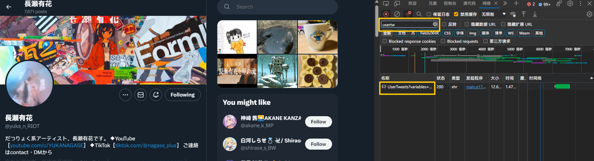

# twitter_scrap

用来拉取某人新推特的工具

## 注意事项

本地缓存文件夹默认为 `cache` 文件夹，screen_name 到 user_id 的缓存为 `name_to_id.json`，请不要随意删除这些文件。

## 使用方法

工程自带一个请求头例子 `headers.json`，里面为空的内容需要自己填充。

1. 随便访问一个推特用户的首页时用浏览器后台的 Network 功能，搜索 `UserTweet` ，通过这个请求获得你自己的请求头。

2. 用自己的请求头填充 `headers.json` 中为空的字段。

3. 把 `headers.json` 放到 python 的工作路径（也就是 `os.path.getcwd()` 会得到的路径）下，就可以使用该请求头进行请求了。



用法可以在 `demo.py` 中查看，获取新推特主要使用 `TwiterGetter` 的两个方法：

```python
from tweet_getter import TweetGetter
fom fetch import fetch
import json
import os

getter = TweetGetter("yuka_n_RIOT")

# 默认 headers 的路径是 python 运行路径下的 headers.json
# 如果需要自行指定路径，也可以用以下 api
# fetch.update_headers_from_file('./example/ie/example.json')

### 根据自己想要的效果选其中一个 api 调用

# 拉取新推特，但不更新本地
res = getter.get()

# 拉取新推特并且更新本地
res = getter.get_and_update()
```

## 工程结构

```bash
│  .gitignore
│  demo.py                 # 使用范例
│  headers.json            # 请求头(headers) json 文件
│  LICENSE
│  name_to_id.json         # screen_name 到 user_id 的本地缓存，如不存在则会在初次使用时生成
│  README.md
│
├─cache                    # 用户推特缓存，如不存在则会在初次使用时生成
│      yuka_n_RIOT---1303687630299643904.json
│
├─twitter_scrap
│  │  cache_io.py          # 本地缓存的读写
│  │  decoder.py           # 核心文件，用于从 twitter API 返回的 json 提取关键字段
│  │  fetch.py             # 网络请求相关
│  │  file.py              # 文件底层操作
│  │  functional.py        # 函数式编程辅助库
│  │  tweet.py             # 提取出的关键字段
│  │  tweet_getter.py      # 对外暴露的主要 api
│  │  updater.py           # 更新策略相关
│  └─ __init__.py
```
